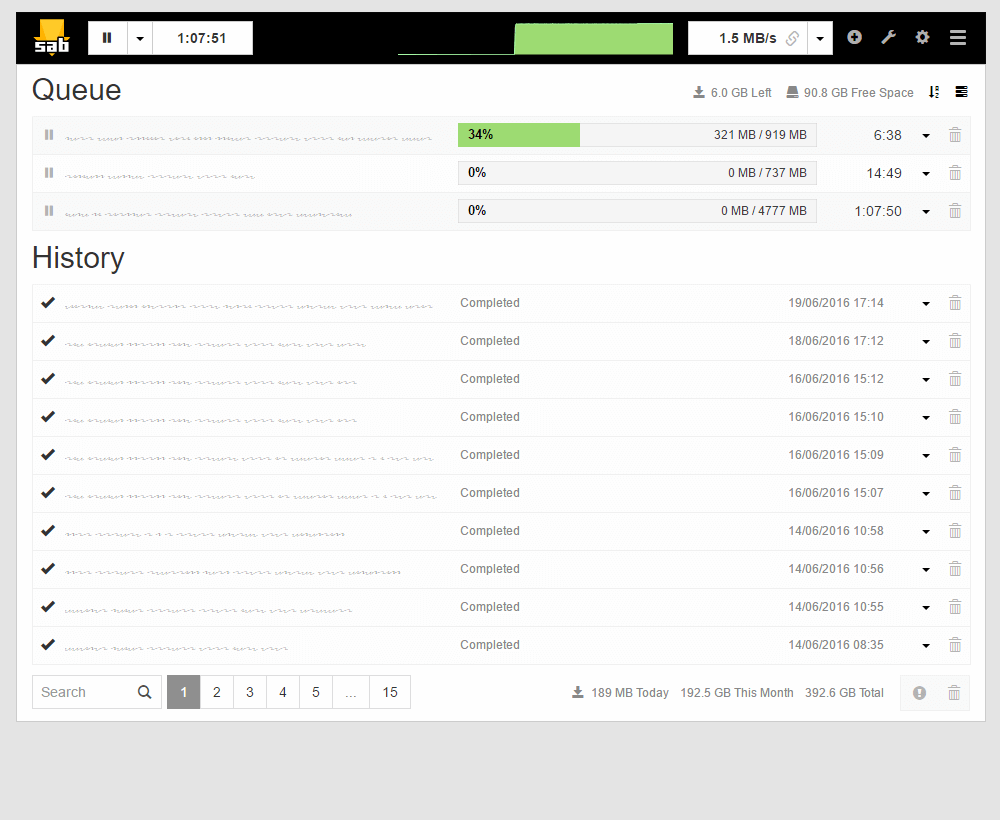

[](https://dash.yunohost.org/appci/app/sabnzbd)    
[](https://install-app.yunohost.org/?app=sabnzbd)

## Vue d'ensemble

> _Ce paquet vous permet d'installer l'application SabNZBD rapidement et simplement sur un serveur YunoHost.
> Si vous n'avez pas YunoHost, veuillez consulter [le guide](https://yunohost.org/#/install) pour savoir comment l'installer._

## Présentation

SABnzbd est un programme permettant de télécharger des fichiers binaires depuis des serveurs Usenet.

### Fonctionnalités

- Orienté serveur, donc accessible via votre navigateur web ;
- Automatisé - SABnzbd s'occupe de toutes les étapes du téléchargement, de la vérification, de la réparation, de la décompression et du nettoyage. Il vous suffit de lui fournir un fichier NZB et, après un certain temps, un téléchargement complet et directement utilisable est disponible ;
- Léger ;

**Shipped version:** 4.5.3~ynh1

## Captures d'écran



<!-- ## Avertissements / informations importantes

- Any known limitations, constrains or stuff not working, such as (but not limited to):

  - requiring a full dedicated domain ?
  - architectures not supported ?
  - not-working single-sign on or LDAP integration ?
  - the app requires an important amount of RAM / disk / .. to install or to work properly
  - etc...

- Other infos that people should be aware of, such as:
  - any specific step to perform after installing (such as manually finishing the install, specific admin credentials, ...)
  - how to configure / administrate the application if it ain't obvious
  - upgrade process / specificities / things to be aware of ?
  - security considerations ? -->

## Documentations et ressources

- Site officiel de l'app : <https://sabnzbd.org>
  <!-- - Documentation officielle utilisateur : <https://yunohost.org/apps> -->
  <!-- - Documentation officielle de l'admin : <https://yunohost.org/packaging_apps> -->
- Dépôt de code officiel de l'app : [<https://github.com/sabnzbd/sabnzbd>](https://github.com/sabnzbd/sabnzbd)
- Documentation YunoHost pour cette app : <https://yunohost.org/app_sabnzbd>
- Signaler un bug : <https://github.com/YunoHost-Apps/sabnzbd_ynh/issues>

## Informations pour les développeurs

Merci de faire vos pull request sur la [branche testing](https://github.com/YunoHost-Apps/sabnzbd_ynh/tree/testing).

Pour essayer la branche testing, procédez comme suit.

```bash
sudo yunohost app install https://github.com/YunoHost-Apps/sabnzbd_ynh/tree/testing --debug
ou
sudo yunohost app upgrade sabnzbd -u https://github.com/BowgartField/SabNZBD_ynh --debug
```

**Plus d'infos sur le packaging d'applications :** <https://yunohost.org/packaging_apps>
